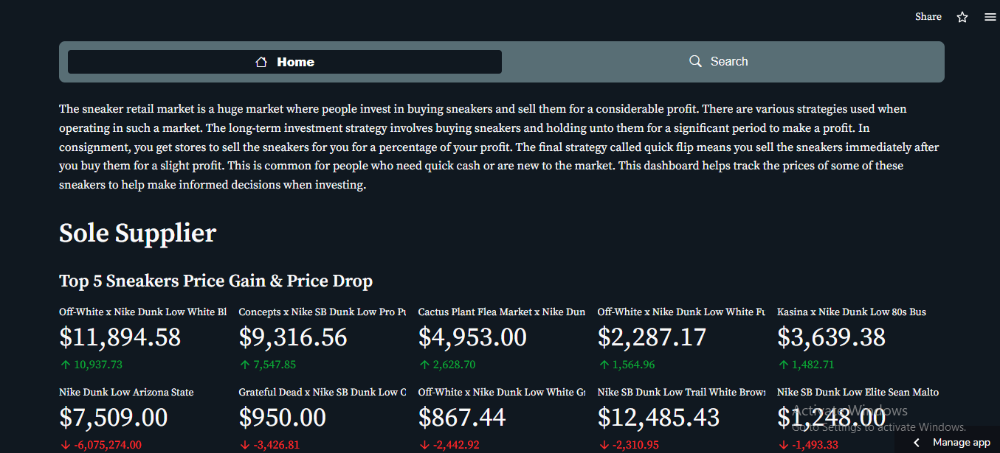

# streamlit-dash


[](https://deji01-streamlit-dash-app-ayvwan.streamlitapp.com/)


## Build Docker Image
build docker image with tag
```sh
docker build -t <Container Name>:latest .
```
list all docker images
```sh
docker images
```
run bash command inside docker container
```sh
docker exec -it <Container Name> bash
```
run docker container
```sh
docker run -d -p 8080:3000 <Container Name> 
```
shut down docker container
```sh
docker stop <Container Name> 
```
login Azure container registry
```sh
docker login <login server>
```
Push Image to Azure container registry
```sh
docker push <Container Name>:latest
```

